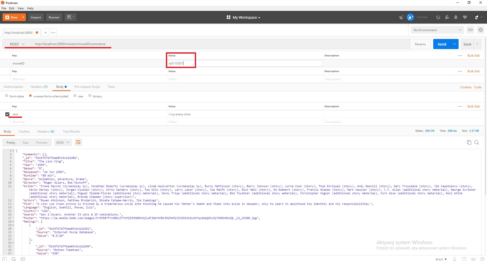

Simple RESTful API
==================

Hi, my name's Bartek and this is my take on RESTful APIs. API consists of:

* /movie post route
* /movie get route
* /comment post route
* /comment get route

I've decided to implement comment routes as nested routes. I think that in real-life app that's the most probable scenario since comments are related to certain movies. This way I could use req.params to pass the movie ID into comment post route. To see all comments send GET request to `/movies/all/comments`. Remember that movie ID is imdbID taken from the external API, not the _id from local mongo database.

Getting started
===============

## Requirements

To run the app you need [MongoDB](https://docs.mongodb.com/manual/installation/) and (of course) [NodeJS](https://nodejs.org/en/). Also remember to install [Postman](https://www.getpostman.com/) so you can test API's behaviour.

## Instructions
Before you start the app you must run mongod.exe to start the database on your machine. It can be found in MongoDB binaries folder.

Open another command prompt and cd into app's main directory, the one with app.js file. From there run  `node app.js` 
If everything is correct you should see this message in your console:  
`The API server is running on port: 3000`

## Postman

The database is empty so we should fill it up a little. Launch Postman and we will send requests to the app to check if routes work correctly. When Postman starts you should see this screen

We want to send post request so we change selection on the dropdown next to URL field to POST. In the URL field enter  `http://localhost:3000/movies`  
Select Body tab and click radio button next to x-www-form-urlencoded. We want to send a title to search in external database, therefore in Key column we enter title and value of our desire. I chose Toy Story because it's a really deep and moving animation.

When you're ready click 'Send'.

If everything works as intended you should see an object containing all the information fetched from the external database.

Try with some other titles. When you have enough, you can try to send GET request to the same URL. It doesn't require any additional elements like title. Now you should see all the movies you've posted to app's database.

Now it's time to check /comment routes. In the URL field enter `http://localhost:3000/movies/:movieID/comments`, select POST method. Click params and in the value field next to movieID enter imdbID of a movie already present in app's database. Now go to Body tab , add key 'text' and write your comment in the adjacent value field.

To see comments for one movie send GET request to `http://localhost:3000/movies/:movieID/comments`. If you want to see all comments that are currently in the database send GET request to `http://localhost:3000/movies/all/comments`. That's all you need to know to use this simple API.

Thank you for your time.