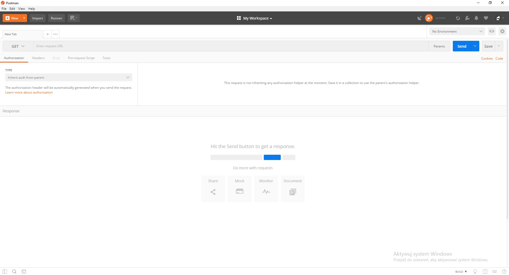
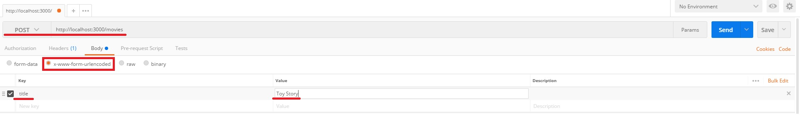

Simple RESTful API
==================

Hi, my name's Bartek and this is my take on RESTful APIs.

Getting started
===============

## Requirements

To run the app you need [MongoDB](https://docs.mongodb.com/manual/installation/) and (of course) [NodeJS](https://nodejs.org/en/). Also remember to install Postman so you can test API's behaviour.

## Instructions
Before you start the app you must run mongod.exe to start the database on your machine. It can be found in MongoDB binaries folder.

Open another command prompt and cd into app's main directory, the one with app.js file. From there run  `node app.js` 
If everything is correct you should see this message in your console:  
`The API server is running on port: 3000`

## Postman

The database is empty so we should fill it up a little. Launch Postman and we will send requests to the app to check if routes work correctly. You should see this screen

To send post request change selection on the dropdown next to URL field to POST. In the URL field enter  `http://localhost:3000/movies`  
Select Body tab and click radio button next to x-www-form-urlencoded. We want to send a title to search in external database, therefore in Key column we enter title and value of our desire. I chose Toy Story because it's a really deep and moving animation.  

When you're ready click 'Send'.